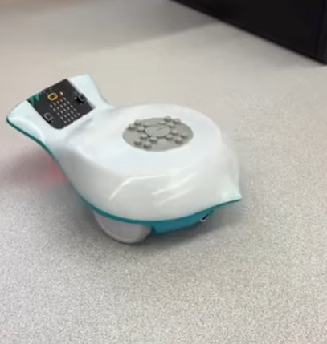

# Final Project: Finch Robot Challenges

## Essential Question
How can we apply object-oriented programming principles and Java concepts to create interactive, autonomous robot behaviors that solve real-world challenges?

## Project Overview
In this project-based learning experience, you will program a Finch 2.0 robot to perform one of three challenges:
1. Choreograph a dance routine (with movement, lights, and sound)
2. Create an artistic drawing using the robot's movements
3. Navigate a maze autonomously

Your program must demonstrate your understanding of Java programming concepts from APCSA and object-oriented design principles while creating an engaging robot behavior.

## Learning Objectives
- Apply Java programming concepts in a physical computing context
- Implement object-oriented design principles
- Develop problem-solving skills through algorithm development
- Create well-documented and maintainable code
- Practice technical communication through presentations and documentation

## Description of design choices
- The Finch was designed to dance to the "Macerena Song"
- Moving foward 6 times 
- Makes a full 360 spin after
- Moves during the chorus

## Challenges faced and solutions
- Finch was moving slow and to fix it we made the spin distance shorter
- Deciding on which challenge we wanted to do. We decided to go with the dance as it seemed the most fun 
- Time Management, as there were days where one of us were not here. We maximized our time the day of the Final to complete the project
## Future enhancements
- Design the finch to have more moves during the song to move on beat
- Implement colors with lights 
- Implement notes onto finch
## Video or images of your robot in action (embedded or linked)

https://www.youtube.com/shorts/hWhyDseRg4M